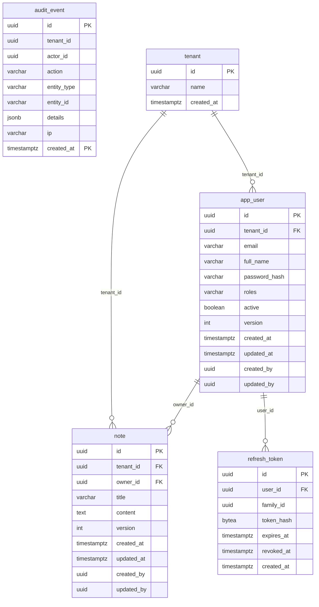

# Sơ đồ cơ sở dữ liệu

> Sinh tự động từ Flyway migrations bằng `gen-erd.sh` - không sửa tay.

```mermaid
erDiagram
    app_user {
        uuid id PK
        uuid tenant_id FK
        varchar email
        varchar full_name
        varchar password_hash
        varchar roles
        boolean active
        int version
        timestamptz created_at
        timestamptz updated_at
        uuid created_by
        uuid updated_by
    }
    audit_event {
        uuid id PK
        uuid tenant_id
        uuid actor_id
        varchar action
        varchar entity_type
        varchar entity_id
        jsonb details
        varchar ip
        timestamptz created_at PK
    }
    note {
        uuid id PK
        uuid tenant_id FK
        uuid owner_id FK
        varchar title
        text content
        int version
        timestamptz created_at
        timestamptz updated_at
        uuid created_by
        uuid updated_by
    }
    refresh_token {
        uuid id PK
        uuid user_id FK
        uuid family_id
        bytea token_hash
        timestamptz expires_at
        timestamptz revoked_at
        timestamptz created_at
    }
    tenant {
        uuid id PK
        varchar name
        timestamptz created_at
    }
    app_user ||--o{ note : "owner_id"
    app_user ||--o{ refresh_token : "user_id"
    tenant ||--o{ app_user : "tenant_id"
    tenant ||--o{ note : "tenant_id"
```
